# การทดลองที่ 8 เรื่องอาร์เรย์และคอลเลคชัน

## (Arrays and Collections)

## 1. Introduction

ข้อมูลที่มีลักษณะคล้ายๆ กันสามารถนำมาเก็บรวมกันไว้อย่างมีประสิทธิภาพด้วย collections คลาสที่ทำหน้าที่เป็น collection อย่างง่ายได้แก่คลาส Array นอกจากนั้นยังมีหลาย ๆ คลาสในเนมสเปซ  System.Collections เช่น

* `System.Collections.Generic`
* `System.Collections.Concurrent`
* `System.Collections.Immutable`

โดยคลาสเหล่านี้มีความสามารถทพื้นฐานต่างๆ ที่กระทำต้อข้อมูล (สมาชิก) ใน collection เช่น

* การเพิ่มสมาชิก (`add` )
* การลบสมาชิก (`remove`)
* การแก้ไขสมาชิก  (`modify`)

หรือแม้แต่กระทำกับสมาชิกในลักษณะเป็นชุด (range of elements) ก็ได้

Collections ในภาษา C# มีให้ใช้ 2 รูปแบบคือ  generic collections และ non-generic collections

Generic collections เริ่มมีใช้ตั้งแต่ .NET Framework รุ่น 2.0 เป็น collections แบบ type-safe ซึ่งทำการตรวจสอบชนิดของข้อมูลที่ใช้ในขณะคอมไพล์ (compile time)  ทำให้ generic collections มีประสิทธิภาพที่ดีกว่า ซึ่ง   Generic collections จะรับ type parameter ในขณะที่เริ่มสร้างทำให้ไม่จำเป็นต้อง cast ไปยังชนิด Object ในการเพิ่ม ลบ หรือ แก้ไข ข้อมูลใน collection

Non-generic collections จะทำการเก็บข้อมูลในลักษณะ Object ทำให้ต้องมีการ casting ไปเป็นขนิดข้อมูลที่ต้องการใช้ ซึ่งมักพบใน code รุ่นเก่าๆ

## 1.1 Common collection features

Collection ทุกชนิดจะมีความสามารถในการ เพิ่ม ลบ และค้นหาสมาชิก   นอกจากนี้ทุกๆ  collections จะถูกบังคับให้ทำตามกฏของอินเตอร์เฟซที่ชื่อ ICollection และ  `ICollection<T> `ไม่ทางตรงก็ทางอ้อม (ทางตรงคือสืบทอดโดยตรง ทางอ้อมคือสืบทอดจากคลาสอื่นที่สืบทอดกฏจาก interface อีกที) ดังนั้น  collection  ทุกตัวจะมีความสามารถต่อไปนี้ (ตามกฏการสืบทอดคุณสมบัติของคลาส)

### 1.1.1 ความสามารถในการ enumerate  สมาชิกใน collection

Collections ใน  .NET Framework ได้่เตรียม interface IEnumerable และ `IEnumerable<T>` ไว้ทั้งสองแบบ เพื่อให้คลาสที่สืบทอดสามารถเข้าถึงสมาชิกทั้งหมดได้ด้วยวิธีการ enumerate ซึ่งจะมีตัว enumerator ที่ทำหน้าท่ี่ีคล้ายตัวชี้ในอาร์เรย์  (movable pointer) ไปยังสมาชิกทุกๆ ใน collection โดยการใช้คำสั่ง  foreach, in และ  For Each...Next รวมทั้งเมธอด  GetEnumerator ทั้งนี้ก็เพื่อลดความซับซ้อนในการเข้าถึงข้อมูลชนิดต่างๆ ใน collection นอกจากนี้ collection ที่มีการ  implements `IEnumerable<T> ` จะมีความสามารถเป็น queryable type  นั่นคือทำให้่สามารถ queried ได้โดย LINQ ซึ่ง LINQ queries จะมีรูปแบบพิเศษในการเข้าถึงข้อมูลคล้ายๆ ภาษา query  เช่น
การเลือกข้อมูล (selecting)  การกรองข้อมูล (filtering) การจัดเรียงข้อมูล (ordering)  การจัดกลุ่มข้อมูล (grouping) ซึ่งใช้งานสะดวกกว่าคำสั่ง foreach loops แบบพื้นฐาน

### 1.1.2 ความสามารถในการคัดลอกเนื้อหาภายใน collection ไปยัง array

เราสามารถคัดลอกเนื้อหาภายใน collections ไปยัง array โดยการใช้เมธอด CopyTo ซึ่งสามารถกำหนดลำดับการคัดลอกได้ด้วย  array ที่ได้จากการคัดลอกจะมีขนาด 1 มิติและมี index เริ่มต้นที่ 0

นอกจากนี้ collection classes จะมีความสามารถเพิ่มเติม ได้แก่

### 1.1.3 การหาความจุ (Capacity) และ ระบุจำนวนสมาชิก (Count)

ความจุ (Capacity) ของ collection คือความสามารถสูงสุดในการบรรจุสมาชิก ส่วนการนับจำนวน (Count) จะระบุจำนวนสมาชิกที่มีอยู่จริง อย่างไรก็ตามบาง collections อาจจะซ่อนทั้งสองค่านี้ไว้

ในการใช้งานจริง collections จะขยายจำนวนสูงสุดที่สามารถบรรจุได้โดยอัตโนมัติเมื่อมีจำนวนสมาชิก ใกล้เต็มความจุ แต่การทำงานจะค่อนข้างซับซ้อน นั่นคือ จะมีการจองหน่วยความจำในที่แห่งใหม่ (ที่มีพื้นที่มากกว่าเดิม) จากนั้นจะคัดลอกเนื้อหาทั้งหมดจากที่เดิมไปยังพื้นที่แห่งใหม่ ที่ทำเช่นนี้ก็เพื่อประหยัด code ที่ใช้ในการจัดการหน่วยความจำของ collection แต่อาจจะทำให้ประสิทธิภาพโดยรวมลดลง เช่นในการใช้  `List<T>`  เป็น collection พบว่าเมื่อ Count ยังมีค่าน้อยกว่า  Capacity การเพิ่มสมาชิก จะมีการทำงานเป็น O(1)  แต่ถ้าเมื่อใดที่ Count มีค่ามากกว่า  Capacity ก็จะมีการทำงานเป็น  O(n) (โดยที่ n คือ Count) วิธีการที่ดีที่สุดในการแก้ปัญหาประสิทธิภาพต่ำ คือการจองพื้นที่ของ collection  ให้เพียงพอแก่การใช้งานตั้งแต่ต้น

มี collections หนึ่งที่ค่อนข้างพิเศษคือ BitArray จะมีความจุ (capacity) เท่าความยาวบิตที่เรากำหนดและเท่ากับ count ด้วย

### 1.1.4 มีจุดเริ่มต้นที่คงที่ (A consistent lower bound)

จุดเริ่มต้น (lower bound) ของ collection หมายถึงเลขที่ลำดับ (index) ของสมาชิกตัวแรก ทุกๆ collections ในเนมสเปซ  System.Collections จะมี lower bound เป็นศูนย์  (0-indexed) ซึ่งมีลักษณะเหมือนกับ Array โดยทั่วๆ ไป แต่อย่างไรก็ตามเราสามารถระบุ lower bound ที่แตกต่างออกไปในขณะที่เริ่มสร้าง  Array โดยใช้เมธอด Array.CreateInstance.

## 2. อาร์เรย์ (Array)

ที่จริงแล้วอาร์เรย์ไม่ได้เป็นส่วนหนึ่งของเนมสเปซ System.Collections แต่อย่างไรก็ตามมันยังคงมีความเป็น  collection ชนิดหนึ่ง เนื่องจากสืบทอดคุณสมบัติมาจากอินเตอร์เฟซที่ชื่อ IList โดยอาร์เรย์จะมีคุณสมบัติและลักษณะเฉพาะดังต่อไปนี้

* สมาชิก (elements) ของอาร์เรย์จะทำหน้าที่เก็บค่าต่างๆ ตามชนิดที่เรากำหนดตอนสร้างอาร์เรย์
* ความยาว (length) ของอาร์เรย์คือความสามารถในการเก็บสมาชิกได้เป็นจำนวนเท่าใดในอาร์เรย์นั้น
* ขอบเขตต่ำสุด (lower bound) ของอาร์เรย์คือลำดับเลขที่ (index) ของสมาชิกตัวแรกสุด ซึ่งมีค่าเท่าใดก็ได้ แต่ถ้าไม่กำหนด  จะมีค่าเริ่มต้นเป็นศูนย์
* อาร์เรย์หลายมิติ (multidimensional Array) สามารถมีขนาดทีแตกต่างกันได้ในแต่ละมิติ และอาร์เรย์สามารถมีได้สูงสุด 32 มิติ
* อาร์เรย์มีลักษณะเป็น collection ชนิดหนึ่งก็จริง แต่จะมีความจุคงที่ นั่นคือเมื่อระบุความจุตอนสร้างอาร์เรย์แล้ว จะไม่สามารถเปลี่ยนแปลงความจุของอาร์เรย์ได้อีก ถ้าต้องการเพิ่มความจุ ก็ต้องสร้างอาร์เรย์ใหม่ แล้วคัดลอกจากสมาชิกทั้งหมดมาจากอาร์เรย์เดิม
* ความจุสูงสุดของอาร์เรย์ (ในระบบ 64 บิต) คือ 2 จิกะไบต์ (GB) เราสามารถสร้างอาร์เรย์ที่มีความจุมากกว่านี้ โดยการไป enabled แอตทริบิวต์ ที่ชื่อ gcAllowVeryLargeObjects ให้เป็น true แต่อย่างไรก็ตาม จะไม่สามารถมีสมาชิกได้มากกว่า 4 พันล้านตัว

### การสร้างอาร์เรย์

การสร้างอาร์เรย์ ใช้รูปแบบต่อไปนี้

```csharp
type[] name = new type[length];
```

เช่น

```csharp
int[] numbers = new int[10];
```

เนื่องจากค่าเริ่มต้นสำหรับ integer มีค่าเป็น 0 ดังนั้นจึงมีข้อมูลภายในค่าเริ่มต้นของอาร์เรย์ดังรูป

```

index	0	1	2	3	4	5	6	7	8	9
value	0	0	0	0	0	0	0	0	0	0
```

การเข้าถึงสมาชิกในอาร์เรย์

```csharp
name[index]               // เข้าถึงสมาชิก (access) ในลำดับที่ index
name[index] = value;      // ปรับปรุงค่าสมาชิก (modify) ในลำดับที่ index
```

## 2.1 การทดลองเรื่องอาร์เรย์

### 2.1.1 การสร้าง การกำหนดค่า และการเข้าถึงสมาชิกในอาร์เรย์

```csharp
using System;

namespace ConsoleAppArray
{
    class Program
    {
        static void Main(string[] args)
        {
            int[] data = new int[10];
            data[0] = 0;
            data[1] = 1;
            data[2] = 2;
            data[3] = 3;
            data[4] = 4;
            data[5] = 5;
            data[6] = 6;
            data[7] = 7;
            data[8] = 8;
            data[9] = 9;
            data[10] = 10;
            Console.WriteLine(data[0]);
            Console.WriteLine(data[1]);
            Console.WriteLine(data[2]);
            Console.WriteLine(data[3]);
            Console.WriteLine(data[4]);
            Console.WriteLine(data[5]);
            Console.WriteLine(data[6]);
            Console.WriteLine(data[7]);
            Console.WriteLine(data[8]);
            Console.WriteLine(data[9]);
            Console.WriteLine(data[10]);
            Console.ReadLine();
        }
    }
}
```

➢ รันโปรแกรมและบันทึกผล ถ้ามีปัญหา แก้ไขอย่างไร อธิบายว่าเหตุใดจึงเป็นเช่นนั้น


``` text
จากการรันโปรแกรมเกิดการ error แก้ไขโดยลบ data[10] = 10; และ Console.WriteLine(data[10]);
เพราะว่ามีการกำหนดค่าอาเรย์คือ10 แต่ประกาศผลมาเกินทำให้เกิดการerror
```

## แบบฝึกหัด

จงประกาศและสร้างตัวแปรสำหรับอาร์เรย์ ที่สอดคล้องกับเงื่อนไขที่กำหนด


แบบฝึกหัดข้อที่1
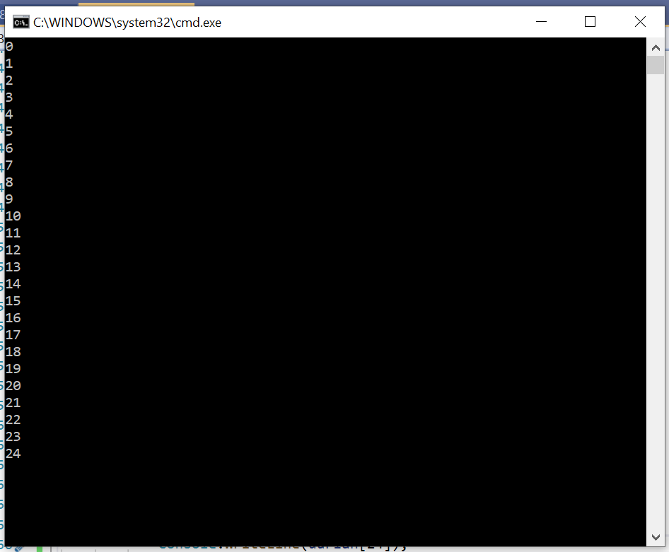
แบบฝึกหัดข้อที่2
``` text
float [] stuGPA = new float [45];
```
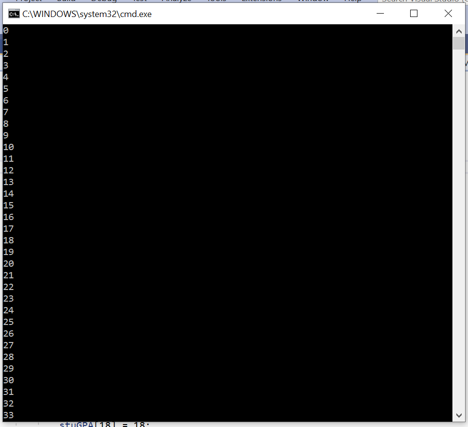
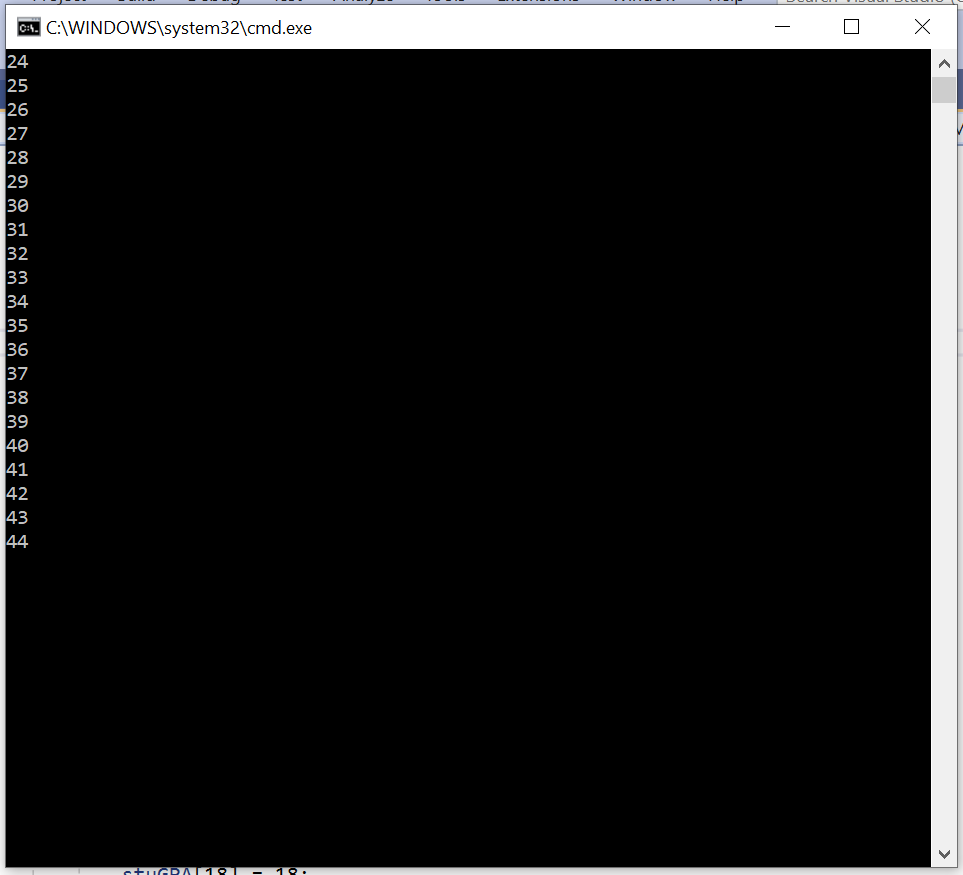
แบบฝึกหัดข้อที่3

### 2.1.2 การอ้างถึงสมาชิกในอาร์เรย์

ให้แก้โปรแกรมในข้อ 2.1.1 เป็นดังต่อไปนี้

```csharp
using System;

namespace ConsoleAppArray
{
    class Program
    {
        static void Main(string[] args)
        {
            int[] data = new int[10];
            data[-1] = 0;
            data[1] = 1;
            data[9] = 9;
            data[10] = 10;
            Console.WriteLine(data[-1]);
            Console.WriteLine(data[1]);
            Console.WriteLine(data[9]);
            Console.WriteLine(data[10]);
            Console.ReadLine();
        }
    }
}
```

➢ รันโปรแกรมและบันทึกผล ถ้ามีปัญหา แก้ไขอย่างไร อธิบายว่าเหตุใดจึงเป็นเช่นนั้น


``` text
จากการรันเกิดการ error เพราะการประกาศผลต้องไม่ติดลบและเริ่มจาก0 
และมีการกำหนดค่าอาเรย์คือ10 แต่ประกาศผลเกินที่กำหนด 
แก้ไขโดยลบ data[10] = 10; และ Console.WriteLine(data[10]);
```
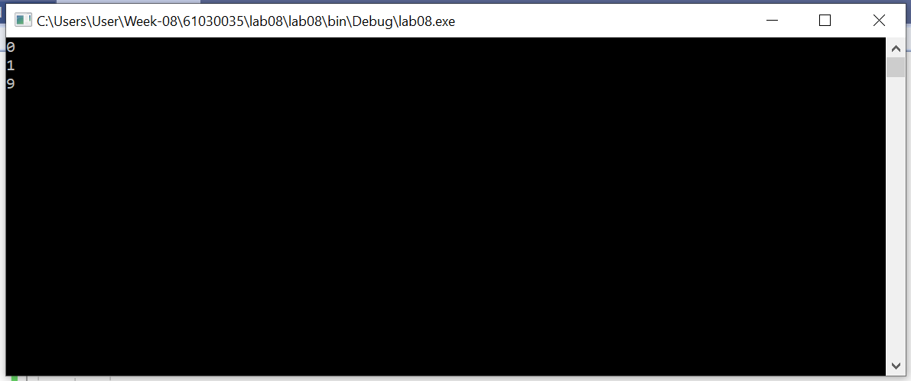
### แบบฝึกหัด

จากโปรแกรมในข้อ 2.1.2 จงเขียนบรรทัดคำสั่ง ตามเงื่อนไขต่อไปนี้

1. นำค่าจากข้อมูลในลำดับที่ 7 ของอาร์เรย์มาแสดงผลบนจอภาพ
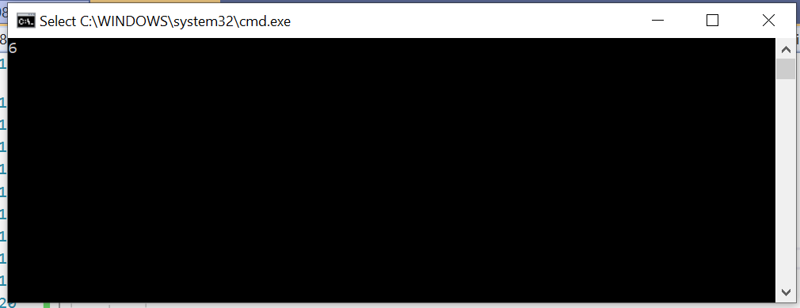

2. นำค่าที่ได้จากข้อมูลในลำดับที่ 4 และ 9 ของอาร์เรย์มาบวกกัน แล้วแสดงผลบนจอภาพ
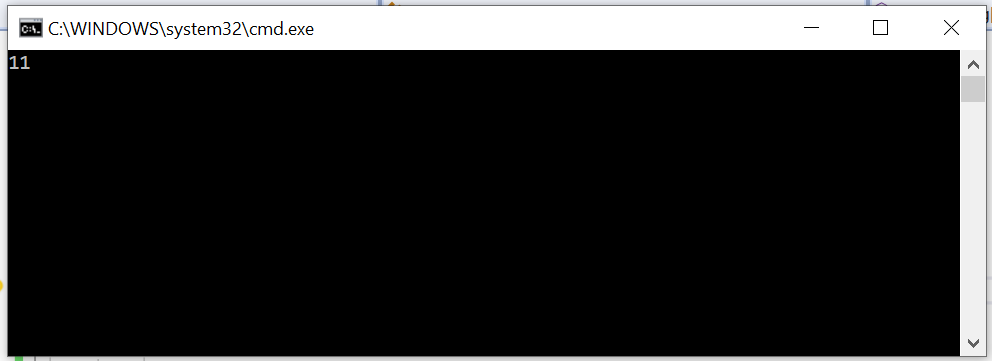

3. ทดสอบว่าข้อมูลในลำดับที่ 2 และ 6 ของอาร์เรย์เท่ากันหรือไม่ แล้วแสดงผลบนจอภาพ
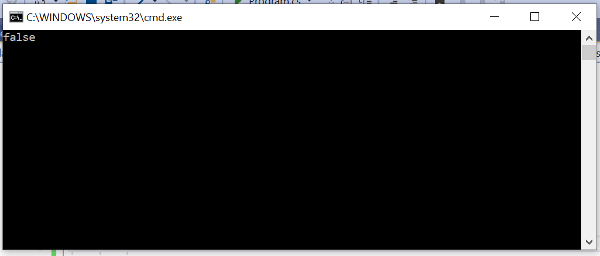

4. คำนวณผลรวมของข้อมูลทั้งหมดในอาร์เรย์ พร้อมทั้งแสดงผลบนจอภาพ


5. เขียนโปรแกรมวนรอบเพื่อแสดงค่าทั้งหมดในอาร์เรย์
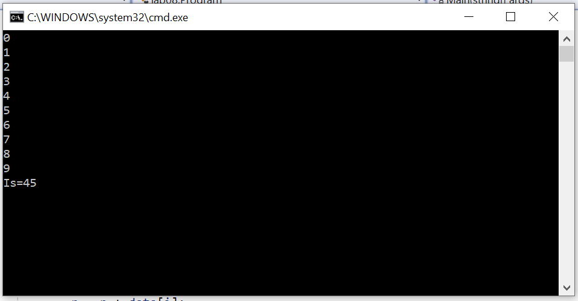

### 2.1.3 การตรวจสอบจำนวนสมาชิกในอาร์เรย์

เราสามารถตรวจสอบขนาดของอาร์เรย์ได้จาก field ที่ชื่อ length

```csharp
using System;

namespace ConsoleAppArray
{
    class Program
    {
    	static void Main(string[] args)
    	{
        	int[] data = new int[10];
        	Student[] student = new Student[31];
           Console.WriteLine(data.Length);
        	Console.WriteLine(student.Length);
        	Console.ReadLine();
    	}
       class Student     // nested class
       {
           private string name;
           public string Name
           {
              get { return name; }
            	set { name = value; }
           }
    	}
    }
}
```

➢	รันโปรแกรมและบันทึกผล ถ้ามีปัญหา แก้ไขอย่างไร อธิบายว่าเหตุใดจึงเป็นเช่นนั้น


### 2.1.4 การกำหนดค่าเริ่มต้นให้สมาชิกในอาร์เรย์

เราสามารถกำหนดค่าเริ่มต้นให้สมาชิกในอาร์เรย์ตามรูปแบบต่อไปนี้

```csharp
type[] name = {value, value, … value};
```

ให้เขียนโปรแกรมดังต่อไปนี้

```csharp
using System;

namespace ConsoleAppArray
{
    class Program
    {
    	static void Main(string[] args)
    	{
            int[] data = { 51, 58, 14, 20, -5, 61, 7, 21, 6 };
            Console.WriteLine("Length of data = {0}", data.Length);
            for (int i = 0; i < data.Length; i++)
            {
                Console.WriteLine(data[i]);
            }
            Console.ReadLine();
        }
    }
}
```

➢ รันโปรแกรมและบันทึกผล ถ้ามีปัญหา แก้ไขอย่างไร อธิบายว่าเหตุใดจึงเป็นเช่นนั้น
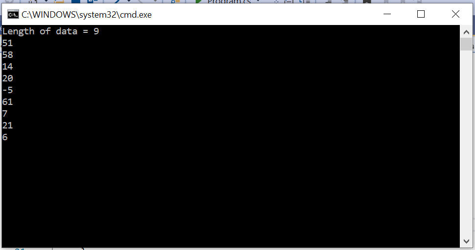


### แบบฝึกหัด

1.	ให้เขียนโปรแกรมหาค่าเกรดเฉลี่ย (GPA) เมื่อป้อนค่า GPS จำนวน 8 ภาคการศึกษา โดยให้รับค่าจากการป้อนของผู้ใช้ ครั้งละ 1 ภาคการศึกษา แล้วนำค่าไปเก็บในอารเรย์ และสิ่งที่ต้องแสดงบนหน้าจอคือ  
a.	คะแนน GPS รายเทอม  
b.	คะแนน GPA  
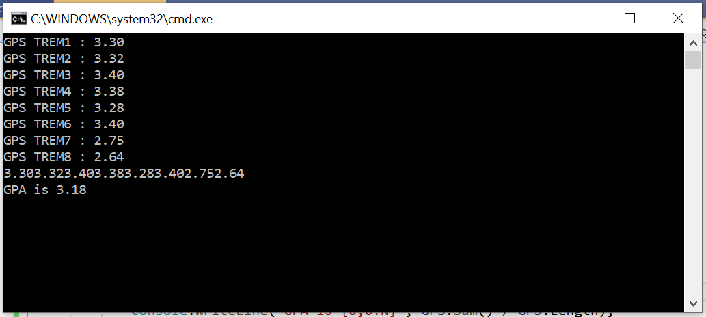
2.	การคำนวณชื่อวันในแต่ละเดือน สามารถทำได้เมื่อทราบว่าวันที่ 1  ของแต่ละเดือน ตรงกับวันอะไร จากนั้นกำหนดเลขประจำชื่อวัน ได้แก่ อาทิตย์ = 0, จันทร์ = 1, … , ศุกร์ = 5 และ  เสาร์ = 6  นำวันที่ที่ต้องการทราบ มาบวกด้วยเลขประจำชื่อวันของวันที่ 1 เสร็จแล้วให้ลบด้วย 1 แล้วไป mod ด้วย 7 จะได้เศษซึ่งสามารถบอกเป็นชื่อวันได้ เช่น วันที่ 1 กันยายน 2560 ตรงกับวันศุกร์ ถ้าต้องการทราบว่าวันที่ 15 กันยายน ตรงกับวันใด จะคำนวณได้จาก 15 (วันที่ที่ต้องการทราบ)  + 5 (เลขประจำวันที่ 1 เดือนกันยายน 2560) - 1 = 19 จากนั้นนำ 19 ไป  mod (%) ด้วย 7  ได้เศษ 5 หมายถึงวันศุกร์ หรือวันที่ 14 เดือนมีนาคม 2560 สามารถหาได้จาก (14 + 3 - 1) % 7 = 2 ตรงกับวัน อังคาร เป็นต้น (ในที่นี้ใช้เลข 3 เนื่องจากวันที่ 1 มีนาคม 2560 คือวันพุธ)  
a.	ให้สร้างอาร์เรย์ที่มีขนาดเป็น 12 แล้วเก็บเลขประจำวันของวันที่ 1   ในแต่ละเดือน ของปี พ.ศ. 2560  
b.	แสดงข้อความรับค่าวันที่และเดือนจากผู้ใช้  
c.	คำนวณตามอัลกอริทึมที่อธิบายในโจทย์  
d.	แสดงชื่อวันออกทางหน้าจอในรูปแบบ  `dd/mm/yyyy is <day name>`.

 
## 2.2 การปฏิบัติการต่างๆ บนอาร์เรย์

### 2.2.1 การค้นหาสมาชิกในอาร์เรย์

การค้นหาสมาชิกในอาร์เรย์ ทำได้โดยการใช้คลาส Array และเมธอดภายในคลาสที่ชื่อ Find เพื่อทำการค้นหาสมาชิกที่ต้องการ โดยไม่ต้องทำการวนลูป และยังสามารถกำหนดรูปแบบหรือเงื่อนไขในการค้นหาได้ตามต้องการ
การใช้งานเมธอด Array.Find
    (https://msdn.microsoft.com/en-us/library/d9hy2xwa(v=vs.110).aspx)

ให้เขียนโปรแกรมดังต่อไปนี้

```csharp
 using System;

namespace ConsoleAppArray
{
    class Program
    {
        static void Main(string[] args)
        {
            string[] array1 = { "cat", "dog", "carrot", "bird" };
            //
            // ค้นหาสมาชิกตัวแรกที่มีค่าตามกำหนด
            //
            string value1 = Array.Find(array1, element => element.StartsWith("car", StringComparison.Ordinal));

            string value2 = Array.Find(array1, element => element.StartsWith("fish", StringComparison.Ordinal));

            //
            // ค้นหาสมาชิกตัวแรกที่มีความยาว string ตามกำหนด
            //
            string value3 = Array.Find(array1, element => element.Length == 3);
            //
            // ค้นหา string ที่มีความยาวไม่เกินค่าที่กำหนด
            //
            string[] array2 = Array.FindAll(array1, element => element.Length <= 4);
            Console.WriteLine(value1);
            Console.WriteLine(value2);
            Console.WriteLine(value3);
            Console.WriteLine(string.Join(",", array2));
            Console.ReadLine();
        }
    }
}
```

➢ รันโปรแกรมและบันทึกผล ถ้ามีปัญหา แก้ไขอย่างไร อธิบายว่าเหตุใดจึงเป็นเช่นนั้น


### แบบฝึกหัด

1. สร้างอาร์เรย์ ที่เก็บชื่อเดือน ในภาษาอังกฤษ  
a. ค้นหาชื่อเดือนแรกที่มีความยาวน้อยที่สุด  
b. ค้นหาชื่อเดือนแรกที่มีความยาวมากกว่า 10 ตัวอักษร  
c. ค้นหาชื่อเดือนที่มีตัวอักษรตัวแรกเหมือนเดือนมกราคม แล้วนำมาแสดงรวมกันในบรรทัดเดียว คั่นด้วย ,
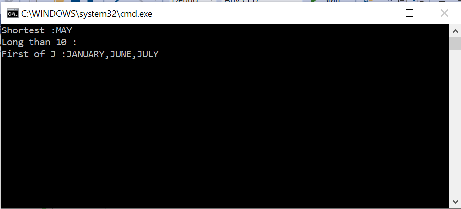

2.	สร้างอาร์เรย์ ที่เก็บประเทศต่างๆ ในโลก (ภาษาอังกฤษ)  
a.	หาชื่อประเทศที่ลงท้ายด้วยคำว่า แลนด์  “land”  
b.	หาชื่อประเทศที่ลงท้ายด้วยคำว่า สถาน “stan”  
 __หมายเหตุ__ รายการชื่อประเทศดูได้จาก https://www.dotnetperls.com/country-array
หรือ fork ได้จาก https://github.com/RodrigoEspinosa/POP3.git ซึ่งอยู่ในไฟล์ https://github.com/RodrigoEspinosa/POP3/blob/master/POP3/POP3/AuxiliaryClases/CountryArray.cs


### 2.2.2 การเรียงข้อมูลในอาร์เรย์

การเรียงข้อมูลในอาร์เรย์ ทำได้โดยการใช้คลาส Array และเมธอดภายในคลาสที่ชื่อ  Sort

## การใช้งานเมธอด Array.Sort()

https://msdn.microsoft.com/en-us/library/system.array.sort(v=vs.110).aspx

ในการทดลองนี้ จะมีบางส่วนที่ใช้ความสามารถในการจัดการข้อมูลในอาร์เรย์โดย LINQ ซึ่งเป็น feature หนึ่งของในภาษา C# ที่จะช่วยในการจัดการข้อมูลในการทำงานร่วมกันระหว่างข้อมูลแบบต่างๆ รวมทั้งฐานข้อมูลและอาร์เรย์ด้วย (การทดลองนี้จะนำ LINQ มาใช้เพื่อให้เห็นความสามารถของการจัดการข้อมูลอย่างง่ายในอาร์เรย์ โดยรายละเอียดของ LINQ จะอยู่ในการทดลองเรื่อง LINQ)

ให้เขียนโปรแกรมดังต่อไปนี้

```csharp
using System;
using System.Linq;

namespace ConsoleAppArray
{
    class Program
    {
        static void Main(string[] args)
        {
            // Array of characters.
            char[] array1 = { 'q', 'w', 'e', 'r', 't', 'y', 'u', 'i', 'o', 'p' };
            Array.Sort (array1);

            // Array of strings.
            string[] colors = new string[] { "red", "orange", "blue", "green", "yellow", "lemon", "aqua"  };
            Array.Sort(colors);

            string[] AseanCountries = new string[] { "Cambodia", "Malaysia", "Indonesia", "Singapore", "Thailand", "Philippines", "Vietnam", "Brunei Darussalam", "Laos", "Myanmar" };

            // C# program that uses LINQ
            var sortAscending = from country in AseanCountries
                                   orderby country
                                   select country;
            var sortDescending = from country in AseanCountries
                                   orderby country descending
                                   select country;

            // print output
            Console.WriteLine("------Character sorting----------");
            foreach (var c in array1)
                Console.WriteLine(c);

            Console.WriteLine("------String sorting----------");
            foreach (string color in colors)
            	    Console.WriteLine(color);

            Console.WriteLine("------String sort ascending----------");
            foreach (string c in sortAscending)
	        Console.WriteLine(c);

            Console.WriteLine("------String sort descending----------");
            foreach (string c in sortDescending)
                Console.WriteLine(c);
            // wait
            Console.ReadLine();
        }
    }
}
```

➢ รันโปรแกรมและบันทึกผล ถ้ามีปัญหา แก้ไขอย่างไร อธิบายว่าเหตุใดจึงเป็นเช่นนั้น

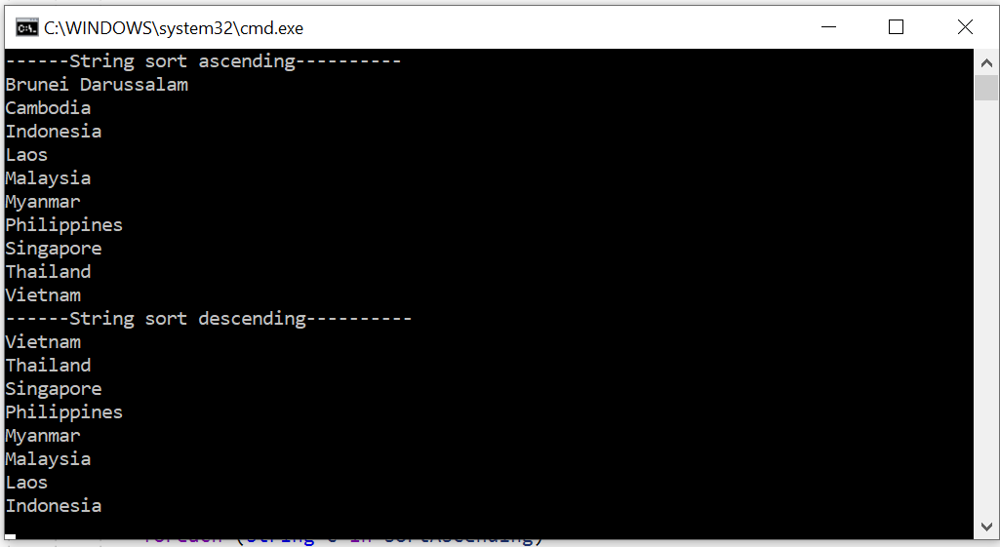

### แบบฝึกหัด

1. สร้างอาร์เรย์ ที่เก็บชื่อเดือน ในภาษาอังกฤษ  
a. เรียงลำดับชื่อตามตัวอักษรจากน้อยไปมาก  
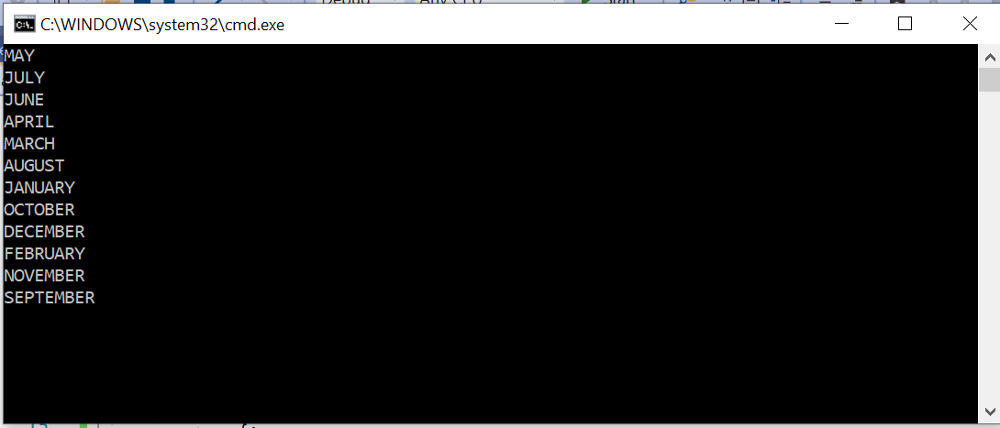

b. เรียงลำดับชื่อตามตัวอักษรจากมากไปน้อย  


2. สร้างอาร์เรย์ ที่เก็บประเทศต่างๆ ในโลก (ภาษาอังกฤษ)  
a. เรียงลำดับชื่อตามตัวอักษรจากน้อยไปมาก
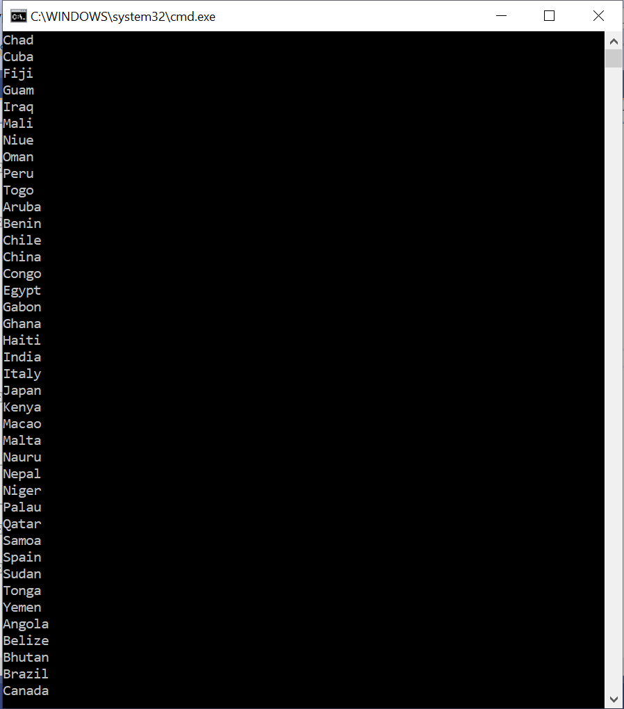  
b. เรียงลำดับชื่อตามตัวอักษรจากมากไปน้อย  
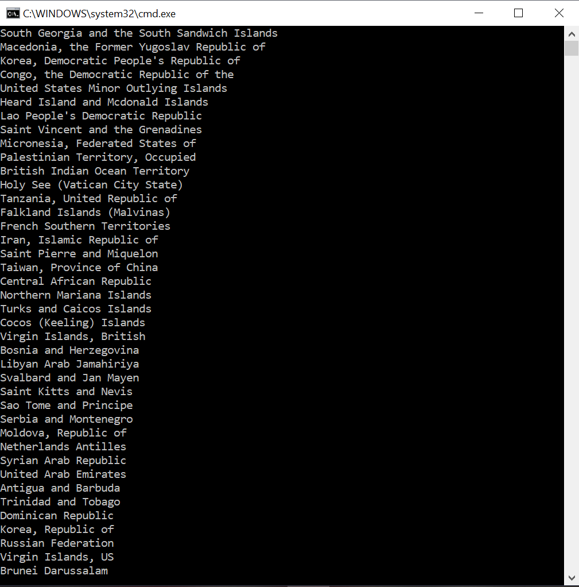

### 2.2.3 การคัดลอกข้อมูลในอาร์เรย์

การคัดลอกข้อมูลในอาร์เรย์ ทำได้โดยการใช้คลาส Array และเมธอดภายในคลาสที่ชื่อ Copy
อาร์เรย์จัดเป็นข้อมูลแบบ reference type การใช้ตัวดำเนินการ = เช่น `a = b;` (เมื่อทั้ง a และ b เป็นอาร์เรย์ทั้งคู่) จะเป็นการบอกให้ตัวแปรอาร์เรย์ a ชี้ที่ตำแหน่งเก็บข้อมูลเดียวกันกับ b ถ้าหากมีการเปลี่ยนแปลงค่าของสมาชิกโดย a หรือ b ก็แล้วแต่ ก็เท่ากับว่ามีการเปลี่ยนแปลงค่าของสมาชิกตัวเดียวกัน ถ้าหากต้องการคัดลอกค่าจากอาร์เรย์ต้นทางไปยังปลายทาง โดยอาร์เรย์ทั้งสองสามารถใช้งานได้อย่างอิสระ เราต้องใช้เมธอด `Array.Copy()`

ให้เขียนโปรแกรมดังต่อไปนี้

```csharp
using System;

namespace ConsoleAppArray
{
    class Program
    {
        static void Main(string[] args)
        {
            int[] ArrayA = new int[] { 1, 2, 3, 4, 5, 6 };
            int[] ArrayB = new int[6] ;
            // copy by operator =
            ArrayB = ArrayA;

            Console.WriteLine("*** Array copy by operator = ***");
            Console.WriteLine("===== Before =====");
            for (int i = 0; i < ArrayA.Length; i++)
            {
                Console.WriteLine("arrayA[{0}] = {1}, ArrayB[{0}] = {2}",i, ArrayA[i], ArrayB[i]);
            }
            // change element 0 of ArrayA
            ArrayA[0] = 9;
            Console.WriteLine("===== After ======");
            for (int i = 0; i < ArrayA.Length; i++)
            {
                Console.WriteLine("ArrayA[{0}] = {1}, ArrayB[{0}] = {2}", i, ArrayA[i], ArrayB[i]);
            }

            // copy by method Array.Copy()
            int[] ArrayC = new int[6];
            Array.Copy(ArrayA, ArrayC, ArrayA.Length);

            Console.WriteLine("*** Array copy by method Array.Copy() ***");
            Console.WriteLine("===== Before =====");
            for (int i = 0; i < ArrayA.Length; i++)
            {
                Console.WriteLine("ArrayA[{0}] = {1}, ArrayC[{0}] = {2}", i, ArrayA[i], ArrayC[i]);
            }
            // change element 0 of ArrayA
            ArrayA[0] = 1;
            Console.WriteLine("===== After =====");
            for (int i = 0; i < ArrayA.Length; i++)
            {
                Console.WriteLine("ArrayA[{0}] = {1}, ArrayC[{0}] = {2}", i, ArrayA[i], ArrayC[i]);
            }

            // wait
            Console.ReadLine();
        }
    }
}
```

➢ รันโปรแกรมและบันทึกผล ถ้ามีปัญหา แก้ไขอย่างไร อธิบายว่าเหตุใดจึงเป็นเช่นนั้น

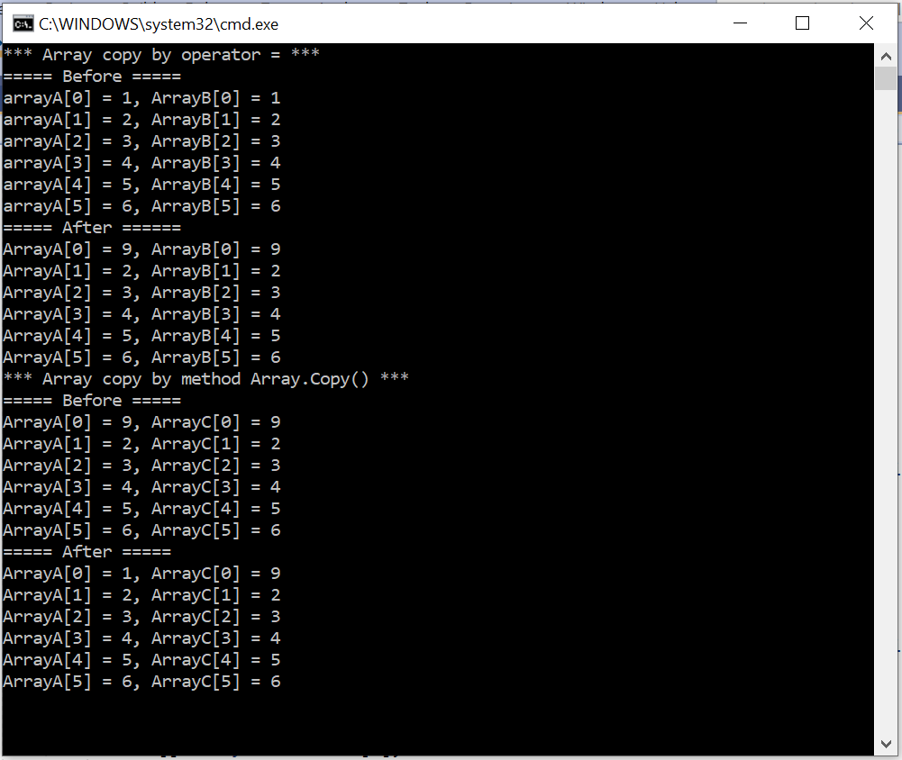  

## แบบฝึกหัด

1. สร้างอาร์เรย์ ที่เก็บชื่อเดือน ในภาษาอังกฤษ  
a. คัดลอกชื่อเดือนที่ลงท้ายด้วย “ber” มาไว้ในอาร์เรย์ใหม่  
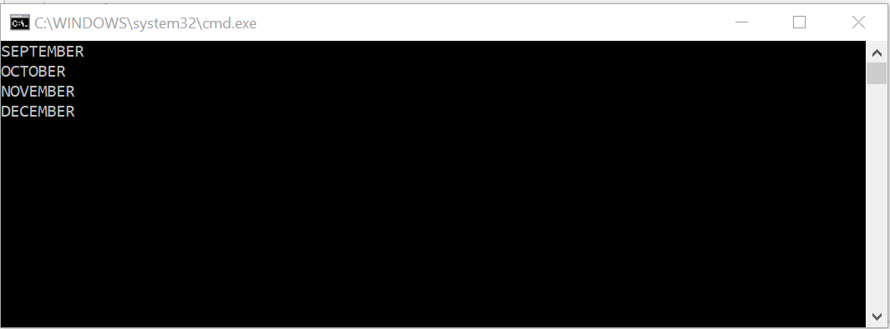  

b. คัดลอกชื่อเดือนที่ลงท้ายด้วย “ry” มาไว้ในอาร์เรย์ใหม่  
  

2. สร้างอาร์เรย์ ที่เก็บประเทศต่างๆ ในโลก (ภาษาอังกฤษ)  
a. คัดลอกชื่อประเทศที่ลงท้ายด้วย “land” มาไว้ในอาร์เรย์ใหม่  
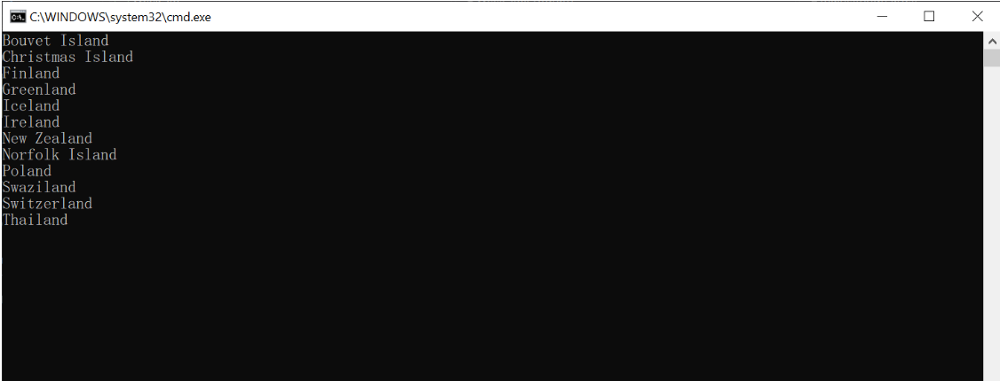 

b. คัดลอกชื่อประเทศที่ลงท้ายด้วย “stan” มาไว้ในอาร์เรย์ใหม่
 


## อาร์เรย์หลายมิติ

อาร์เรย์หลายมิติ มี 2 ลักษณะคือ อาร์เรย์ที่มีมิติขององค์ประกอบในมิติอื่นๆ มีขนาดเท่ากันเรียกว่า multidimension array และอาร์เรย์ที่มีมิติขององค์ประกอบอื่นที่มีขนาดแตกต่างกัน เรียกว่า jagged array

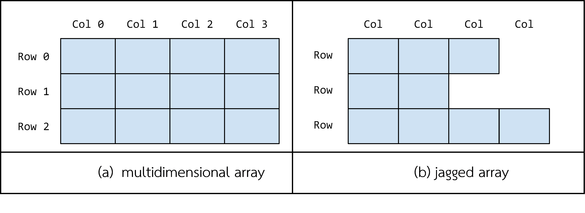

## 2.3 อาร์เรย์หลายมิติ (multidimensional array)

การใช้งานอาร์เรย์ในชีวิตประจำวัน เราอาจจะพบว่ามีบางกรณีที่เราต้องเก็บค่าไว้ในอาร์เรย์มากกว่า 1 มิติ เช่นที่นั่งในโรงภาพยนตร์ เลขคู่ลำดับ เมตริกซ์ ช่องตารางในโปรแกรม spread sheet (เช่น google sheet หรือ Microsoft Excel) รวมทั้งข้อมูลที่มีมิติที่สูงขึ้น เช่นเวคเตอร์  3 มิติ  เป็นต้น  ในภาษา C# สามารถเก็บข้อมูลได้มากถึง 32 มิติ

### 2.3.1 การประกาศและสร้างตัวแปรอาร์เรย์ 2 มิติ

* รูปแบบการประกาศตัวแปรอาร์เรย์ 2 มิติ

```csharp
<Data Type> [ , ] <Array Name>;
```

โดยที่ `<Data Type>` หมายถึงชนิดข้อมูล, `<Array Name>` หมายถึงชื่อตัวแปร ส่วนเครื่งหมาย [ , ] เป็นตัวระบุว่าเราต้องการสร้างอาร์เรย์ 2 มิติ

* รูปแบบการสร้างตัวแปรอาร์เรย์ 2 มิติ

```csharp
<Array Name> = new <Data Type> [num_rows, num_columns ] ;
```

โดยที่ num_rows และ num_columns หมายถึงจำนวนแถวและคอลัมน์ตามลำดับ
นอกจากนี้ เรายังสามารถยุบรวมเหลือเพียงขั้นตอนเดียว ดังรูปแบบต่อไปนี้

```csharp
<Data Type> [ , ] <Array Name> = new <Data Type> [num_rows, num_columns ] ;
```

* การหาจำนวนแถวในอาร์เรย์ 2 มิติ ทำได้โดยใช้คำสั่ง

```csharp
<Array Name>.GetLength(0);
```

* การหาจำนวนหลักในอาร์เรย์ 2 มิติ ทำได้โดยใช้คำสั่ง

```csharp
<Array Name>.GetLength(1);
```

ให้เขียนโปรแกรมดังต่อไปนี้

```csharp
using System;
using System.Collections.Generic;
using System.Linq;
using System.Text;
using System.Threading.Tasks;

namespace MultidimensionalArray
{
    class Program
    {
        static void Main(string[] args)
        {
            int[,] multiplyTable = new int[12, 12];
            multiplyTable[0, 0]  = 2 * 1;
            multiplyTable[1, 0]  = 2 * 2;
            multiplyTable[2, 0]  = 2 * 3;
            multiplyTable[3, 0]  = 2 * 4;
            multiplyTable[4, 0]  = 2 * 5;
            multiplyTable[5, 0]  = 2 * 6;
            multiplyTable[6, 0]  = 2 * 7;
            multiplyTable[7, 0]  = 2 * 8;
            multiplyTable[8, 0]  = 2 * 9;
            multiplyTable[9, 0]  = 2 * 10;
            multiplyTable[10, 0] = 2 * 11;
            multiplyTable[11, 0] = 2 * 12;
            for (int row = 0; row < multiplyTable.GetLength(0); row++)
            {
                for (int col = 0; col < multiplyTable.GetLength(1); col++)
                {
                    Console.Write("{0,5}",multiplyTable[row,col]);
                }
                Console.WriteLine();
            }
            Console.ReadLine();
        }
    }
}
```

➢ รันโปรแกรมและบันทึกผล ถ้ามีปัญหา แก้ไขอย่างไร อธิบายว่าเหตุใดจึงเป็นเช่นนั้น
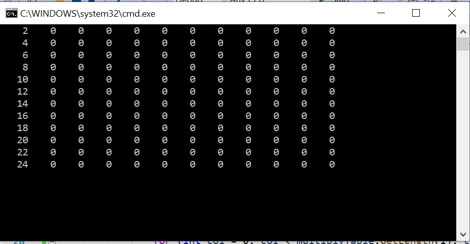 

### แบบฝึกหัด

1. จงประกาศและสร้างตัวแปรสำหรับอาร์เรย์ พร้อมทั้งกำหนดค่าเริ่มต้นให้กับอาร์เรย์ โดยสอดคล้องกับเงื่อนไขที่กำหนด


ข้อ2
``` text
string [,] character = new string [26,2]
```
ข้อ3
``` text
int [,] monthday = new int [12,1]
```
ข้อ4
``` text
float [,,] cube = new float [3,3,3]
```

2. จงแก้ตารางสูตรคูณในข้อ 2.3.1 ให้สมบูรณ์ โดยใช้วิธีการวนลูปสำหรับกำหนดค่าให้อาร์เรย์แทนที่จะประกาศรายตัวเช่นดังในตัวอย่าง
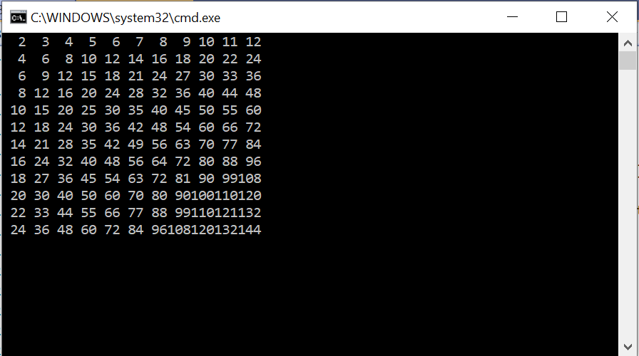

## 2.4 อาร์เรย์ของอาเรย์ (jagged array)

อาร์เรย์ของอาเรย์จะมีลักษณะต่างจากอาร์เรย์หลายมิติที่เราศึกษาไปในหัวข้อ 2.3  
ในการสร้างอาร์เรย์ของอาเรย์นี้เราจะใช้เครื่องหมาย [] จำนวน 2 ชุดด้วยกัน ดังตัวอย่าง

### 2.4.1 การประกาศและสร้างตัวแปรอาร์เรย์ของอาเรย์ (jagged array)

* รูปแบบการประกาศตัวแปรอาร์เรย์ของอาเรย์

```csharp
<Data Type> [ ][ ] <Array Name>;
```

โดยที่ `<Data Type>` หมายถึงชนิดข้อมูล, `<Array Name>` หมายถึงชื่อตัวแปร ส่วนเครื่งหมาย [ ][ ] เป็นตัวระบุว่าเราต้องการสร้างอาร์เรย์ของอาเรย์

* รูปแบบการสร้างตัวแปรอาร์เรย์ของอาเรย์

```csharp
<Array Name> = new <Data Type> [num_rows][];
```
นอกจากนี้ เรายังสามารถยุบรวมเหลือเพียงขั้นตอนเดียว ดังรูปแบบต่อไปนี้

```csharp
<Data Type> [][] <Array Name> = new <Data Type> [num_rows]
{
    new <Data Type> [num_rows],
    new <Data Type> [num_rows],
    new <Data Type> [num_rows],
} ;
```

ให้เขียนโปรแกรมดังต่อไปนี้

```csharp
using System;

namespace ArrayOfArray
{
    class Program
    {
        static void Main(string[] args)
        {
            int[][] jagged = new int[7][];
            int count = 0;
            for (int row = 0; row < jagged.GetLength(0); ++row)
            {
                Console.Write("\nRow {0}:", row);
                jagged[row] = new int[row + 1];
                for (int index = 0; index < row + 1; ++index)
                {
                    ++count;
                    jagged[row][index] = count;
                    Console.Write(" {0}", count);
                }
            }
            Console.WriteLine("\n\nTotals");
            for (int row = 0; row < jagged.GetLength(0); ++row)
            {
                int total = 0;
                for (int index = 0; index < jagged[row].GetLength(0); ++index)
                {
                    total += jagged[row][index];
                }
                Console.Write("\nRow {0}: {1}", row, total);
            }
            Console.ReadLine();
        }
    }
}
```

➢ รันโปรแกรมและบันทึกผล ถ้ามีปัญหา แก้ไขอย่างไร อธิบายว่าเหตุใดจึงเป็นเช่นนั้น
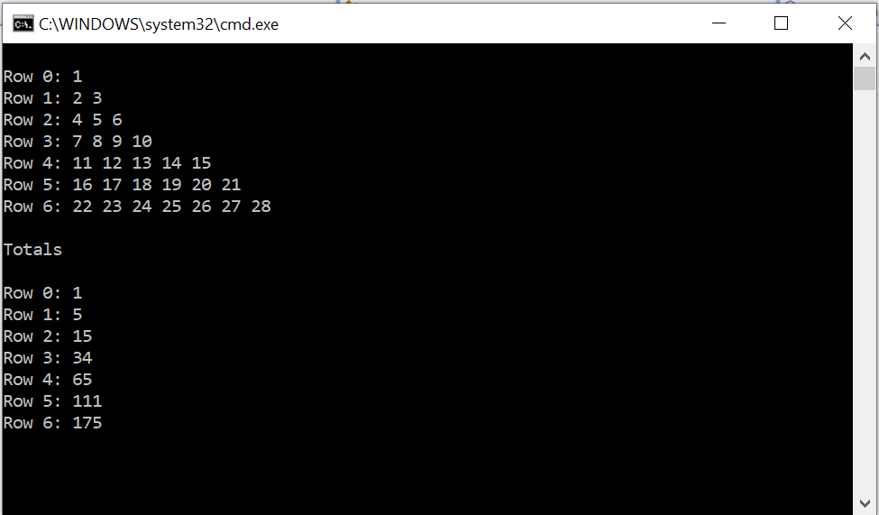

### แบบฝึกหัด

1. สร้าง Jagged array ที่มีขนาด 2 แถว โดยแถวที่ 1 บรรจุชื่อวันทั้ง 7 วัน และแถวที่ 2 บรรจุชื่อเดือนทั้ง 12 เดือน


2. สร้าง Jagged array ที่บรรจุชื่อประเทศต่างๆ แบ่งตามพื้นที่ทวีป โดยอ้างอิงจาก รายชื่อประเทศ ดินแดน และเมืองหลวง
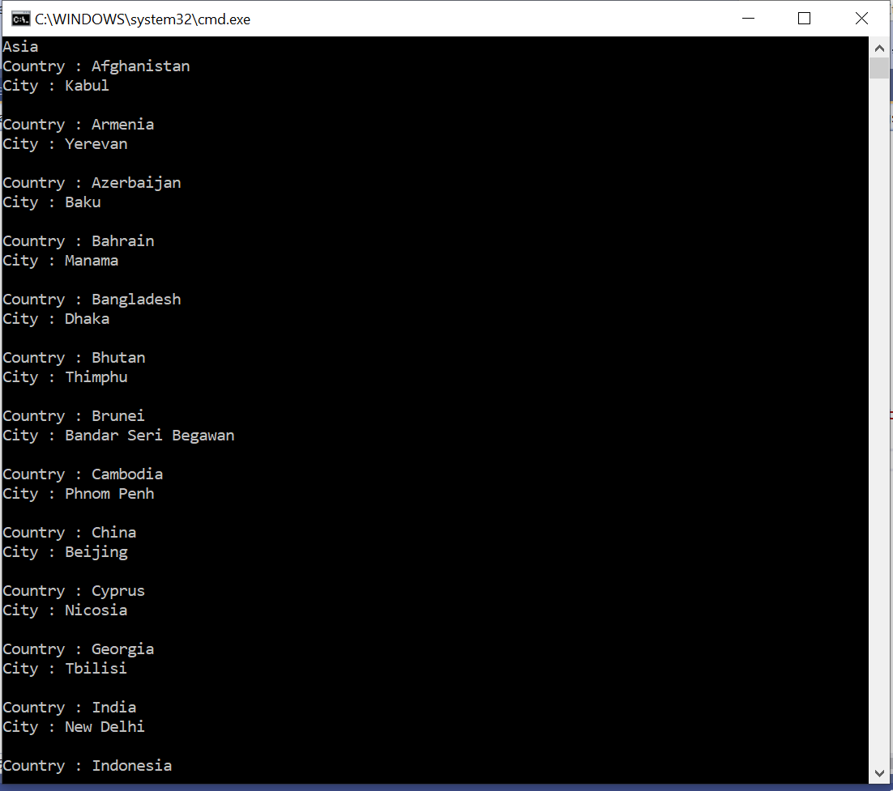

## 3. Collection

ถึงแม้ว่าเราจะสามารถใช้งานอาร์เรย์ในการเก็บและจัดการกับข้อมูล แต่การใช้อาร์เรย์ก็มีข้อจำกัดหลายๆ อย่าง เช่น อาร์เรย์เป็นหน่วยเก็บข้อมูลที่มีขนาดคงที่ ซึ่งถูกกำหนดในขณะสร้างอาร์เรย์ อีกทั้งสมาชิกในอาร์เรย์จะต้องเป็นข้อมูลชนิดเดียวกันเท่านั้น ซึ่งก็ต้องระบุในขณะสร้างอาร์เรย์เช่นกัน ดังนั้นในการพัฒนา .NET Framework Class Library (FCL) จึงได้มีการจัดเตรียมคลาสที่เป็น collection ที่ทำงานกับโครงสร้างข้อมูลแบบต่างๆ ซึ่งอยู่ในเนมสเปซที่ชื่อ  System.Collection
ตารางต่อไปนี้แสดง collection class ที่ใช้งานบ่อย


Collection  ในตาราง จะมีการใช้งานที่เหมือนๆ กัน เนื่องจาก สืบทอดคุณสมบัติมาจากอินเตอร์เฟซที่ชื่อว่า  ICollection เช่นเดียวกัน โดยเบื้องต้นจะมี properties จำนวน 3 ตัวและมีเมธอด method จำนวน 1 เมธอด ได้แก่


## 3.1 อาร์เรย์ลิสต์ (ArrayList)

อาร์เรย์ลิสต์ เป็น collection หนึ่งใน System.Collection  ที่มีการทำงานเช่นเดียวกับอาร์เรย์ แต่ต่างกันตรงที่อาร์เรย์ลิสต์สามารถเก็บข้อมูลชนิดใดๆ ก็ได้ ไม่จำเป็นต้องระบุค่าความจุในขณะเริ่มสร้าง  ขนาดของอาร์เรย์ลิสต์ จะเพิ่มโดยอัตโนมัติ เราสามารถทราบขนาดของอาร์เรย์ลิตส์โดย property ที่ชื่อ Capacity เนื่องจากขนาดของอาร์เรย์ลิสต์จะเปลี่ยนแปลงอยู่เสมอ ระบบจะทำการสร้างอาร์เรย์ขึ้นมาใหม่และคัดลอกข้อมูลจากอาร์เรย์ เก่า

### 3.1.1 การเพิ่ม-ลบข้อมูลและหาความจุของอาร์เรย์ลิสต์

ให้เขียนโปรแกรมดังต่อไปนี้

```csharp
using System;
using System.Collections;

namespace ArrayListDemo
{
    class Program
    {
        static void Main(string[] args)
        {
            ArrayList list = new ArrayList();
            Console.WriteLine("Create a list");
            Console.WriteLine("List capacity = {0,2}", list.Capacity);
            for (int i = 0; i < 100; i++)
            {
                Console.Write("Add int to list : {0,2} => ", i);
                list.Add(i);
                Console.WriteLine("List count =  {0,3}, capacity = {1,3}  ",
                  list.Count, list.Capacity );
            }
            Console.WriteLine("-----------------------");
            for (int i = 0; i < 100; i++)
            {
                Console.Write("Remove int from list : {0,2} => ", i);
                list.Remove(i);
                Console.WriteLine("List count =  {0,3}, capacity = {1,3}  ",
                  list.Count, list.Capacity);
            }
            Console.ReadLine();
        }
    }
}
```

➢ รันโปรแกรมและบันทึกผล ถ้ามีปัญหา แก้ไขอย่างไร อธิบายว่าเหตุใดจึงเป็นเช่นนั้น


### คำถาม

1. เมื่อความจำนวนสมาชิกในอาร์เรย์ลิสต์ (Count) เพิ่มขึ้นถึงค่าเท่าใดบ้างจึงจะมีการเพิ่มค่าความจุ (Capacity)
 การเพิ่มค่าความจุจะมีค่าเพิ่มขึ้น

2. การเพิ่มค่าความจุในอาร์เรย์ลิสต์มีลักษณะเป็นอย่างไร

เป็นการเพิ่มข้อมูลตามที่เราต้องการเป็น2เท่า

### 3.1.2 การตรวจสอบความจุและขนาดของอาร์เรย์ลิสต์

ให้เขียนโปรแกรมดังต่อไปนี้

```csharp
using System;
using System.Collections;

namespace ArrayListDemo
{
    class Program
    {
        static void Main(string[] args)
        {
            ArrayList list1 = new ArrayList();
            list1.Add(1);
            list1.Add(2);
            list1.Add(3);
            list1.Add(4);
            list1.Add(5);
            Console.WriteLine("list1 count = {0}, capacity = {1}", list1.Count, list1.Capacity);
            ArrayList list2 = new ArrayList(20);
            Console.WriteLine("list2 count = {0}, capacity = {1}", list2.Count, list2.Capacity);
            ArrayList list3 = new ArrayList(list1);
            Console.WriteLine("list3 count = {0}, capacity = {1}", list3.Count, list3.Capacity);
            ArrayList list4 = new ArrayList(list2);
            Console.WriteLine("list4 count = {0}, capacity = {1}", list4.Count, list4.Capacity);
            Console.ReadLine();
        }
    }
}
```

➢ รันโปรแกรมและบันทึกผล ถ้ามีปัญหา แก้ไขอย่างไร อธิบายว่าเหตุใดจึงเป็นเช่นนั้น

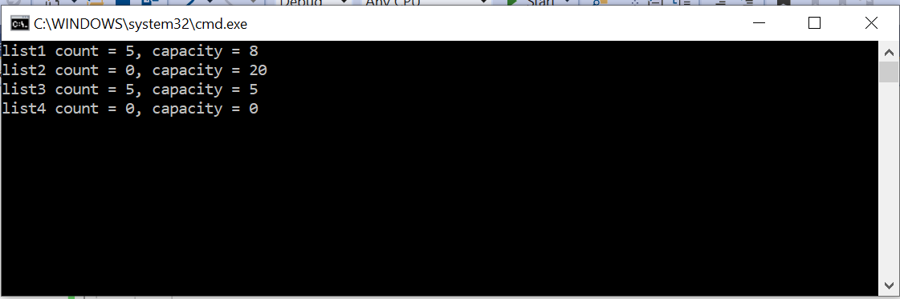

### คำถาม

1. เหตุใด ค่าของ Count และ Capacity จึงไม่เท่ากัน
2. ถ้ามีการลบสมาชิกออกจากอาร์เรย์ลิสต์ (Count) จะมีการลดความจุ  (Capacity) ลงในหรือไม่ ถ้าลดลงจะเป็นลักษณะเดียวกับตอนเพิ่มขึ้นหรือไม่

### 3.1.3 การเข้าถึงสมาชิกในอาร์เรย์ลิสต์แบบต่างๆ

การเข้าถึงสมาชิกลำดับที่ต้องการในอาร์เรย์ลิสต์ สามารถทำได้ ทำได้โดยการใช้ตัวดำเนินการ [] ได้เช่นเดียวกับอาร์เรย์ทั่วๆ ไป
ให้เขียนโปรแกรมดังต่อไปนี้

```csharp
using System;
using System.Collections;

namespace ArrayListDemo
{
    class Program
    {
        static void Main(string[] args)
        {
            ArrayList list1 = new ArrayList();
            list1.Add(10);
            list1.Add(20);
            list1.Add(30);
            list1.Add(40);
            for (int i = 0; i < list1.Count; i++)
            {
                Console.WriteLine(list1[i]);
            }
            ArrayList list2 = new ArrayList(list1);
            list2[2] = 55;
            list2[3] = 66;
            list2[4] = 77;

            for (int i = 0; i < list2.Count; i++)
            {
                Console.WriteLine(list2[i]);
            }
            Console.ReadLine();
        }
    }
}
```

➢ รันโปรแกรมและบันทึกผล ถ้ามีปัญหา แก้ไขอย่างไร อธิบายว่าเหตุใดจึงเป็นเช่นนั้น

``` text

บันทึกผลการทดลอง


```

## คำถาม

1. เราสามารถกำหนดค่าให้กับสมาชิกอาร์เรย์ลิสต์แบบเดียวกับอาร์เรย์ธรรมดา (เช่น `list[1] = 5;`) ได้หรือไม่อย่างไร
2. เราสามารถใช้การอ้างถึงตำแหน่งโดยการคำนวณได้หรือไม่ (เช่น `int a =list[1*2];`)

## งานค้นคว้า

นอกจากที่กล่าวมา ยังมีเมธอดอื่นๆ ที่น่าสนใจ ให้ ศึกษาและทดลองเขียนโปรแกรมโดยใช้งานเมธอดต่อไปนี้ พร้อมทั้งอธิบายว่าแต่ละเมธอดหมายถึงอะไร ใช้งานในกรณีใด

* `RemoveAt(int)`
* `Remove(object)`
* `Insert(int, object)`
* `Clear()`
* `CopyTo()`
* `IndexOf()`

## 3.2 คิว (Queue)

การทำงานของคิวจะมีลักษณะเป็น collection สำหรับการจัดการข้อมูลแบบเข้าก่อน-ออกก่อน (first-in, first-out collection of Objects)  สิ่งที่ใส่ในคิวเป็นลำดับแรกจะถูกดึงออกจากคิวเป็นลำดับแรกเช่นกัน นอกจากนี้ คลาสคิว ยังมีความสามารถในการ insertion, extraction และ inspection ในการป้อนข้อมูลเข้าสู่คิวเรียกว่า Enqueue และในการดึงข้อมูลออกจากคิวเรียกว่า Dequeue  และสามารถทำการ Peek ซึ่งจะส่งกลับ reference  ไปยังสมาชิกลำดับแรกในคิว (ซึ่งจะถูก dequeue เป็นตัวแรก)  การ peek นี้จะไม่ดึงข้อมูลออกจากคิว คิวรองรับ null reference และสามารถใส่สมาชิกที่มีค่าซ้ำกันได้

### 3.2.1 การสร้างและใช้งานคิวเบื้องต้น

ให้เขียนโปรแกรมดังต่อไปนี้

```csharp
using System;
using System.Collections.Generic;

namespace QueueDemo
{
    class Program
    {
        static void Main(string[] args)
        {
            Queue<int> q = new Queue<int>();
            Console.WriteLine("-- enqueue 3 items -- ");
            q.Enqueue(10);
            q.Enqueue(20);
            q.Enqueue(30);
            Console.Write("Queue contains : ");
            foreach (var item in q)
            {
                Console.Write (item + " ");
            }
            Console.WriteLine(Environment.NewLine +  "q.Count  = {0}", q.Count);
            Console.WriteLine("q.Peek = {0}",q.Peek());

            Console.WriteLine("-- enqueue more items -- ");
            q.Enqueue(40);
            q.Enqueue(50);

            Console.Write("Queue contains : ");
            foreach (var item in q)
            {
                Console.Write(item + " ");
            }
            Console.WriteLine(Environment.NewLine + "q.Count  = {0}", q.Count);
            Console.WriteLine("q.Peek = {0}", q.Peek());

            Console.WriteLine("-- dequeue -- ");
            int i = q.Dequeue();
            Console.WriteLine("i = {0}", i);

            Console.Write ("Queue contains : ");
            foreach (var item in q)
            {
                Console.Write (item + " ");
            }
            Console.WriteLine(Environment.NewLine + "q.Count  = {0}", q.Count);
            Console.WriteLine("q.Peek = {0}", q.Peek());
            Console.ReadLine();
        }
    }
}
```

➢ รันโปรแกรมและบันทึกผล ถ้ามีปัญหา แก้ไขอย่างไร อธิบายว่าเหตุใดจึงเป็นเช่นนั้น

``` text

บันทึกผลการทดลอง


```

### 3.2.2 การตรวจสอบสมาชิกในคิวด้วยเมธอด Contains()

ให้เขียนโปรแกรมดังต่อไปนี้

```csharp
using System;
using System.Collections.Generic;

namespace QueueDemo
{
    class Program
    {
        static void Main(string[] args)
        {
            Queue<string> queue1 = new Queue<string>();
            queue1.Enqueue("Red");
            queue1.Enqueue("Green");
            queue1.Enqueue("Blue");
            queue1.Enqueue("Orange");
            queue1.Enqueue("Yellow");
            Console.WriteLine("The elements in the queue are:");
            foreach (string s in queue1)
            {
                Console.WriteLine(s);
            }
            Console.WriteLine("The element Red is contain in the queue:" + queue1.Contains("Red"));
            Console.WriteLine("The element Black is contain in the queue:" + queue1.Contains("Black"));
            Console.WriteLine("The element Purple is contain in the queue:" + queue1.Contains("Purple"));
            Console.WriteLine("The element Green is contain in the queue:" + queue1.Contains("Green"));
            Console.ReadLine();
        }
    }
}
```

➢ รันโปรแกรมและบันทึกผล ถ้ามีปัญหา แก้ไขอย่างไร อธิบายว่าเหตุใดจึงเป็นเช่นนั้น

``` text

บันทึกผลการทดลอง


```

### 3.2.3 การล้างข้อมูลในคิวด้วยเมธอด Clear()

ให้เขียนโปรแกรมดังต่อไปนี้

```csharp
using System;
using System.Collections.Generic;

namespace QueueDemo
{
    class Program
    {
        static void Main(string[] args)
        {
            Queue<string> queue1 = new Queue<string>();
            queue1.Enqueue("RED");
            queue1.Enqueue("BLUE");
            queue1.Enqueue("YELLOW");
            queue1.Enqueue("GREEN");

            Console.WriteLine("The elements in the queue are:" + queue1.Count);
            queue1.Clear();
            Console.WriteLine("The elements in the queue are after the clear
 method:" + queue1.Count);
            Console.ReadLine();
        }
    }
}
```

➢ รันโปรแกรมและบันทึกผล ถ้ามีปัญหา แก้ไขอย่างไร อธิบายว่าเหตุใดจึงเป็นเช่นนั้น

``` text

บันทึกผลการทดลอง


```

### 3.2.4 การคัดลอกข้อมูลในคิวมายังอาร์เรย์ด้วยเมธอด ToArray()

ให้เขียนโปรแกรมดังต่อไปนี้

```csharp
using System;
using System.Collections;
using System.Collections.Generic;

namespace QueueDemo
{
    class Program
    {
        static void Main(string[] args)
        {
            Queue<int> queue1 = new Queue<int>();
            queue1.Enqueue(10);
            queue1.Enqueue(20);
            queue1.Enqueue(30);
            queue1.Enqueue(40);
            Console.WriteLine("The queue elements are:");
            foreach (int i in queue1)
            {
                Console.WriteLine(i);
            }
            ArrayList array = new ArrayList(queue1.ToArray());
            Console.WriteLine("\nContents of the copy");
            foreach (int i in array)
            {
                Console.WriteLine(i);
            }
            Console.ReadLine();
        }
    }
}
```

➢ รันโปรแกรมและบันทึกผล ถ้ามีปัญหา แก้ไขอย่างไร อธิบายว่าเหตุใดจึงเป็นเช่นนั้น

``` text

บันทึกผลการทดลอง


```

## 3.3 สแตค (Stack)

### 3.3.1 การใช้งานสแตคเบื้องต้น

ให้เขียนโปรแกรมดังต่อไปนี้

```csharp
using System;
using System.Collections.Generic;

namespace StackDemo
{
    class Program
    {
        static void Main(string[] args)
        {
            Stack<int> s = new Stack<int>();
            Console.WriteLine("-- add 4 items -- ");
            s.Push(10);
            s.Push(20);
            s.Push(30);
            s.Push(40);
            Console.Write("Stack contains : ");
            foreach (var item in s)
            {
                Console.Write(item + " ");
            }
            Console.WriteLine(Environment.NewLine + "s.Count  = {0}", s.Count);
            Console.WriteLine("s.Peek = {0}", s.Peek());

            Console.WriteLine("-- add more items -- ");
            s.Push(50);
            s.Push(60);

            Console.Write("Queue contains : ");
            foreach (var item in s)
            {
                Console.Write(item + " ");
            }
            Console.WriteLine(Environment.NewLine + "s.Count  = {0}", s.Count);
            Console.WriteLine("s.Peek = {0}", s.Peek());

            Console.WriteLine("-- push -- ");
            int i = s.Pop();
            Console.WriteLine("i = {0}", i);

            Console.Write("Stack contains : ");
            foreach (var item in s)
            {
                Console.Write(item + " ");
            }
            Console.WriteLine(Environment.NewLine + "s.Count  = {0}", s.Count);
            Console.WriteLine("s.Peek = {0}", s.Peek());
            Console.ReadLine();
        }
    }
}
```

➢ รันโปรแกรมและบันทึกผล ถ้ามีปัญหา แก้ไขอย่างไร อธิบายว่าเหตุใดจึงเป็นเช่นนั้น

``` text

บันทึกผลการทดลอง


```

### 3.3.2 การตรวจสอบสมาชิกในสแตคด้วยเมธอด Contains()

ให้เขียนโปรแกรมดังต่อไปนี้

```csharp
using System;
using System.Collections.Generic;

namespace StackDemo
{
    class Program
    {
        static void Main(string[] args)
        {
            Stack<string> stack1 = new Stack<string>();
            stack1.Push("************");
            stack1.Push("RED");
            stack1.Push("GREEN");
            stack1.Push("BLUE");
            stack1.Push("YELLOW");
            stack1.Push("***********");
            stack1.Push("** COLOR **");
            stack1.Push("***********");
            Console.WriteLine("The elements in the stack1 are as:");
            foreach (string s in stack1)
            {
                Console.WriteLine(s);
            }
            Console.WriteLine("The element RED contain in the stack " + stack1.Contains("RED"));
            Console.WriteLine("The element YELLOW contain in the stack " + stack1.Contains("YELLOW"));
            Console.WriteLine("The element BLACK contain in the stack " + stack1.Contains("BLACK"));
            Console.ReadLine();
        }
    }
}
```

➢ รันโปรแกรมและบันทึกผล ถ้ามีปัญหา แก้ไขอย่างไร อธิบายว่าเหตุใดจึงเป็นเช่นนั้น

``` text

บันทึกผลการทดลอง


```

### 3.3.3 การล้างข้อมูลในสแตคด้วยเมธอด Clear()

ให้เขียนโปรแกรมดังต่อไปนี้

```csharp
using System;
using System.Collections.Generic;

namespace StackDemo
{
    class Program
    {
        static void Main(string[] args)
        {
            Stack<string> stack1 = new Stack<string>();
            stack1.Push("************");
            stack1.Push("RED");
            stack1.Push("GREEN");
            stack1.Push("BLUE");
            stack1.Push("YELLOW");
            stack1.Push("***********");
            stack1.Push("** COLOR **");
            stack1.Push("***********");
            Console.WriteLine("The elements in the stack1 are as:");
            foreach (string s in stack1)
            {
                Console.WriteLine(s);
            }
            stack1.Clear();
            Console.WriteLine("After apply the clear method the elements in the stack are:" + stack1.Count);
            Console.ReadLine();
        }
    }
}
```

➢ รันโปรแกรมและบันทึกผล ถ้ามีปัญหา แก้ไขอย่างไร อธิบายว่าเหตุใดจึงเป็นเช่นนั้น

``` text

บันทึกผลการทดลอง


```

### 3.3.4 การคัดลอกข้อมูลในคิวมายังอาร์เรย์ด้วยเมธอด ToArray()

ให้เขียนโปรแกรมดังต่อไปนี้

```csharp
using System;
using System.Collections;
using System.Collections.Generic;

namespace QueueDemo
{
    class Program
    {
        static void Main(string[] args)
        {
            Stack<int> stack1 = new Stack<int>();
            stack1.Push(10);
            stack1.Push(20);
            stack1.Push(30);
            stack1.Push(40);
            Console.WriteLine("The stack elements are:");
            foreach (int i in stack1)
            {
                Console.WriteLine(i);
            }
            ArrayList array = new ArrayList(stack1.ToArray());
            Console.WriteLine("\nContents of the copy");
            foreach (int i in array)
            {
                Console.WriteLine(i);
            }
            Console.ReadLine();
        }
    }
}
```

➢ รันโปรแกรมและบันทึกผล ถ้ามีปัญหา แก้ไขอย่างไร อธิบายว่าเหตุใดจึงเป็นเช่นนั้น

``` text

บันทึกผลการทดลอง


```

## 3.4 ดิกชันนารี (Dictionary)

### 3.4.1 การใช้งานดิกชันนารีเบื้องต้น

ให้เขียนโปรแกรมดังต่อไปนี้

```csharp
using System;
using System.Collections;
using System.Collections.Generic;

namespace DictionaryDemo
{
    class Program
    {
        static void Main(string[] args)
        {
            Dictionary<string, int> dict1 = new Dictionary<string, int>();
            dict1.Add("One", 1);
            dict1.Add("Two", 2);
            dict1.Add("Three", 3);
            dict1.Add("Four", 4);
            dict1.Add("Five", 5);
            dict1.Add("Six", 6);
            dict1.Add("Seven", 7);
            dict1.Add("Eight", 8);
            dict1.Add("Nine", 9);
            dict1.Add("Ten", 10);

            foreach (var item in dict1)
            {
                Console.WriteLine(item);
            }

            foreach (var item in dict1)
            {
                Console.WriteLine("key = {0}, value = {1}", item.Key, item.Value);
            }

            Console.ReadLine();
        }
    }
}
```

➢ รันโปรแกรมและบันทึกผล ถ้ามีปัญหา แก้ไขอย่างไร อธิบายว่าเหตุใดจึงเป็นเช่นนั้น

``` text

บันทึกผลการทดลอง


```

### 3.4.2 การตรวจสอบสมาชิกในดิกชันนารีด้วยเมธอด ContainsKey()

ให้เขียนโปรแกรมดังต่อไปนี้

```csharp
using System;
using System.Collections;
using System.Collections.Generic;

namespace DictionaryDemo
{
    class Program
    {
        static void Main(string[] args)
        {
            Dictionary<string, int> dict1 = new Dictionary<string, int>();
            dict1.Add("One", 1);
            dict1.Add("Two", 2);
            dict1.Add("Three", 3);
            dict1.Add("Four", 4);
            dict1.Add("Five", 5);
            dict1.Add("Six", 6);
            dict1.Add("Seven", 7);
            dict1.Add("Eight", 8);
            dict1.Add("Nine", 9);
            dict1.Add("Ten", 10);
            if (dict1.ContainsKey("One"))
            {
                int value = dict1["One"];
                Console.WriteLine(value);
            }
            if (dict1.ContainsKey("Eleven"))
            {
                int value = dict1["Eleven"];
                Console.WriteLine(value);
            }
            Console.ReadLine();
        }
    }
}
```

➢ รันโปรแกรมและบันทึกผล ถ้ามีปัญหา แก้ไขอย่างไร อธิบายว่าเหตุใดจึงเป็นเช่นนั้น

``` text

บันทึกผลการทดลอง


```

### 3.4.3 การลบสมาชิกในดิกชันนารีด้วยเมธอด Remove()

ให้เขียนโปรแกรมดังต่อไปนี้

```csharp
using System;
using System.Collections;
using System.Collections.Generic;

namespace DictionaryDemo
{
    class Program
    {
        static void Main(string[] args)
        {
            Dictionary<string, string> country = new Dictionary<string, string>();
            country.Add("AF", "Afghanistan");
            country.Add("AL", "Albania");
            country.Add("AS", "American Samoa");
            country.Add("AD", "Andorra");
            country.Add("AM", "Armenia");
            country.Add("AW", "Aruba");
            country.Add("AU", "Australia");
            country.Add("AT", "Austria");
            country.Add("AZ", "Azerbaijan");
            foreach (var item in country)
            {
                Console.WriteLine("{0,2} = {1}", item.Key, item.Value);
            }
            Console.WriteLine("Count of items = {0}", country.Count);
            Console.WriteLine("\n** Direct access to value by key **");
            country["AU"] = "AUSTRALIA";
            Console.WriteLine("AU = " + country["AU"]);

            Console.WriteLine("\n** Remove by key **");
            country.Remove("AU");
            foreach (var item in country)
            {
                Console.WriteLine("{0,2} = {1}", item.Key, item.Value);
            }
            Console.WriteLine("Count of items = {0}", country.Count);
            Console.ReadLine();
        }
    }
}
```

➢ รันโปรแกรมและบันทึกผล ถ้ามีปัญหา แก้ไขอย่างไร อธิบายว่าเหตุใดจึงเป็นเช่นนั้น

``` text

บันทึกผลการทดลอง


```

## แบบฝึกหัด

1. จงเขียนโปรแกรมโดยใช้ dictionary เมื่อผู้ใช้ระบุชนิดของไฟล์ ให้โปรแกรมบอกโปรแกรมที่จะเปิดไฟล์นั้น ดังตารางต่อไปนี้

<table>
    <tr><th>ชนิดของไฟล์ </th><th> แอพปลิเคชั่นที่ใช้เปิดไฟล์</th></tr>
    <tr><td>txt</td><td>Notepad.exe</td></tr>
    <tr><td>bmp</td><td>paint.exe</td></tr>
    <tr><td>rtf</td><td>wordpad.exe</td></tr>
    <tr><td>pdf</td><td>acrobat.exe</td></tr>
</table>

2. จงเขียนโปรแกรมโดยใช้ dictionary เก็บชื่อประเทศในโลก โดยใช้ชื่อย่อเป็น key ในการค้นหา เช่น เมื่อผู้ใช้กรอก อักษรย่อ TH โปรแกรมก็ต้องบอกได้ว่าเป็นประเทศ Thailand เป็นต้น (ใช้ชื่อประเทศและอักษรย่อจากตัวอย่างที่ผ่านๆ มา)

## 3.5 แฮชเทเบิล (HashTable)

แฮชเทเบิลในภาษา C# เป็นคลาสคอลเลคชั่นที่ใช้เก็บคู่ของ key/value เช่นเดียวกับดิกชันนารี ต่างกันตรงที่ key ที่ใช้จะเป็น hash code และดิกชันนารีจะเป็นคอลเลคชั่นแบบ generic  ซึ่งต้องระบุชนิดของข้อมูลที่จะใช้ก่อนเสมอ ข้อแตกต่างระหว่าง Dictionary และ HashTable มีดังต่อไปนี้

1. Hashtable มีลักษณะเป็น threadsafe ขณะที่ Dictionary ไม่ใช่
2. ในการใช้งาน Dictionary จะมีการเก็บข้อมูลเป็นชนิดข้อมูลที่ระบุล่วงหน้าทำให้ไม่ต้องมีการแปลงชนิดในขณะที่ Hashtable ต้องมีการแปลงชนิดข้อมูลเนื่องจากมีการเก็บข้อมูลรวมทั้ง key เป็นชนิด object
3. ถ้าไม่มีข้อมูลที่ต้องการใน dictionary จะเกิด exception แบบ 'KeyNotFoundException' แต่ใน hashtable จะส่งกลับค่า null
4. เมื่อใช้งานกับคอลเลคชั่นขนาดใหญ่  hashtable จะมีประสิทธิภาพสูงกว่า dictionary
5. การเก็บข้อมูลใน hashtable จะไม่สนใจลำดับการเก็บข้อมูล ในขณะที่ dictionary จะรักษาลำดับการใส่ข้อมูล
6. Dictionary ทำงานในลักษณะ chaining ในขณะที่ Hashtable ทำงานแบบ rehashing

### 3.5.1 การใช้งานแฮชเทเบิลเบื้องต้น

ให้เขียนโปรแกรมดังต่อไปนี้

```csharp
using System;
using System.Collections;

namespace HashTableDemo
{
    class Program
    {
        static void Main(string[] args)
        {
            Hashtable weeks = new Hashtable();
            weeks.Add("1", "SunDay");
            weeks.Add("2", "MonDay");
            weeks.Add("3", "TuesDay");
            weeks.Add("4", "WednesDay");
            weeks.Add("5", "ThursDay");
            weeks.Add("6", "FriDay");
            weeks.Add("7", "SaturDay");

            foreach (DictionaryEntry day in weeks)
            {
                Console.WriteLine(day.Key + "   -   " + day.Value);
            }
            Console.ReadLine();
        }
    }
}
```

➢ รันโปรแกรมและบันทึกผล ถ้ามีปัญหา แก้ไขอย่างไร อธิบายว่าเหตุใดจึงเป็นเช่นนั้น

``` text

บันทึกผลการทดลอง


```

### 3.5.2 การตรวจสอบสมาชิกในแฮชเทเบิลด้วยเมธอด ContainsKey() และ ContainsValue()

ให้เขียนโปรแกรมดังต่อไปนี้

```csharp
using System;
using System.Collections;

namespace HashTableDemo
{
    class Program
    {
        static void Main(string[] args)
        {
            Hashtable weeks = new Hashtable();
            weeks.Add("1", "Sunday");
            weeks.Add("2", "Monday");
            weeks.Add("3", "Tuesday");
            weeks.Add("4", "Wednesday");
            weeks.Add("5", "Thursday");
            weeks.Add("6", "Friday");
            weeks.Add("7", "Saturday");

            // Method ContainKey()
            Console.WriteLine("The  key element \"8\" is contain in the Hashtable weeks : " + weeks.ContainsKey("8"));

            // Method ContainValue()
            Console.WriteLine("The  key element \"Wednesday\" is contain in the Hashtable weeks : " + weeks.ContainsValue("Wednesday"));

            Console.ReadLine();
        }
    }
}
```

➢ รันโปรแกรมและบันทึกผล ถ้ามีปัญหา แก้ไขอย่างไร อธิบายว่าเหตุใดจึงเป็นเช่นนั้น

``` text

บันทึกผลการทดลอง


```

### 3.5.3 การลบสมาชิกและล้างข้อมูลในแฮชเทเบิลด้วยเมธอด Remove() และ Clear()

ให้เขียนโปรแกรมดังต่อไปนี้

```csharp
using System;
using System.Collections;

namespace HashTableDemo
{
    class Program
    {
        static void Main(string[] args)
        {
            Hashtable weeks = new Hashtable();
            weeks.Add("1", "Sunday");
            weeks.Add("2", "Monday");
            weeks.Add("3", "Tuesday");
            weeks.Add("4", "Wednesday");
            weeks.Add("5", "Thursday");
            weeks.Add("6", "Friday");
            weeks.Add("7", "Saturday");

            Console.WriteLine("---- elements in Hashtable weeks ----");
            foreach (DictionaryEntry day in weeks)
            {
                Console.WriteLine(day.Key + "   -   " + day.Value);
            }

            Console.WriteLine("\n---- weeks.Remove(\"4\"); ----");
            weeks.Remove("4");
            foreach (DictionaryEntry day in weeks)
            {
                Console.WriteLine(day.Key + "   -   " + day.Value);
            }

            Console.WriteLine("\n---- weeks.Clear(); ----");
            weeks.Clear();
            foreach (DictionaryEntry day in weeks)
            {
                Console.WriteLine(day.Key + "   -   " + day.Value);
            }

            Console.ReadLine();
        }
    }
}
```

➢ รันโปรแกรมและบันทึกผล ถ้ามีปัญหา แก้ไขอย่างไร อธิบายว่าเหตุใดจึงเป็นเช่นนั้น

``` text

บันทึกผลการทดลอง


```

## คำถาม

1. ให้สร้างแฮชเทเบิล ที่บรรจุรหัสไปรษณีย์และชื่อจังหวัด  (ทำในระดับจังหวัดเท่านั้น) แล้วค้นหาจากรหัสไปรษณีย์ที่กำหนด
2. ให้สร้างแฮชเทเบิล ที่บรรจุรหัสนักศึกษาและรายชื่อเพื่อนๆ ในห้องเรียน  (ทำในแขนงคอมพิวเตอร์เท่านั้น) แล้วค้นหาจากรหัสนักศึกษาที่กำหนด
